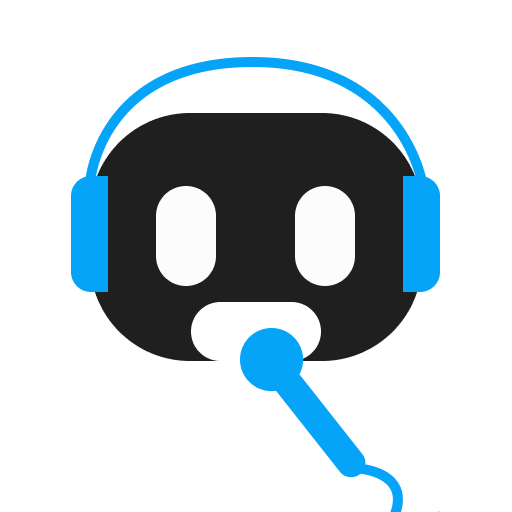

<div align="center">
  
  <h1>chatbot-whatsapp</h1>
  
  
  
  
</div>

<h4 align="center"> 
Desafio pair programming - Zenvia Whatsapp
</h4>

<p align="center">
 <a href="#-sobre-o-projeto">Sobre</a> •
 <a href="#-funcionalidades">Funcionalidades</a> •
 <a href="#-rodando-a-aplicação">Como executar</a> • 
 <a href="#-sugestão-de-melhorias">Melhorias</a> • 
</p>

## 💻 Sobre o projeto

O desafio proposto em realizar uma integração da API da Zenvia utilizando de seu Broker no Whatsapp, para que fosse feito melhorias ou outras abordagens. O projeto base possui uma funcionalidade de ao enviar um arquivo de audio contendo música, este deve retornar o artista com o nome de sua música, e uma prévia da música descoberta.

---

## ⚙️ Funcionalidades

- Ao enviar um arquivo de áudio, deve retornar: nome da música, imagem do albúm e prévia da música.
- Também é retornado a letra da música encontrada.
- Integração de backend com a Estrutra do Builder no ALTU.

---

## 🔴 Demonstração


---

## 📝 Requisitos

Para conseguir rodar o projeto você precisa ter:

### Primeiro passo:

Instale o [ngrok](https://ngrok.com/) na sua maquina com ele voce pode expor uma porta local para ter acesso em qualquer lugar utilizando uma url que ele gera automaticamente quando você roda o comando:

```sh
./ngrok http 3000
```

no nosso caso a porta que vai ser liberada é a **3000**, lembrando que você precisa estar rodando o projeto para que tenha um retorno ao acessar essa url.

### Segundo passo:

Crie uma conta na Zenvia para ter acesso ao sandbox nesse link [zenvia-tutorial](https://www.zenvia.com/blog/developers/whatsapp-bot-nodejs/) nos passos 3 e 4 ele ensina como criar um conta na zenvia e fazer toda a configuracao e na parte de **subscription** coloque a url gerada pelo ngrok.
_obs: guarde sua X-API-TOKEN_

### Terceiro passo:

Crie um bot no Altu e clique em connect->canais->api e criei uma configuracao seguindo esse tutorial [altu-docs](https://docs.altu.d1.cx/connect/canais/bot_api) na parte de url coloque:

```
{sua url ngrok}/answer
```

com isso toda resposta do Builder chegará nessa URL
_obs: guarde o Token_

Utilizamos o [audd](https://audd.io/) para reconhecer as musicas você pode fazer um cadastro no site deles para poder ter acesso a api lembrando que tem um tempo de expiração no modo gratuito, no Builder crie um nó e coloque como ponto de entrada **input.text === 'FILE_SEND'** nesse nó você poderá fazer as chamadas de api diretamente do Altu(incrível 🤯), essa é a estrutura para chamar a api do Audd:

```json
[
  {
    "name": "http_request",
    "parameters": {
      "config": {
        "url": "https://api.audd.io/",
        "data": {
          "url": "<? $details.fileUrl ?>",
          "return": "deezer,apple_music,spotify",
          "api_token": "seu_token_do_audd"
        },
        "method": "POST",
        "headers": {
          "Content-Type": "multipart/form-data"
        }
      },
      "flavor": "axios"
    },
    "result_variable": "api_response"
  }
]
```

a parte de formatar a resposta você pode criar do jeito que achar melhor lembrando de ser do tipo _text_ dentro do
**MENSAGEM PARA O USUÁRIO** do nó.

---

## 🧭 Rodando a aplicação

Você deve criar um arquivo **.env** na raiz do seu projeto contendo as seguintes variaves:

- ZENVIA_TOKEN: token gerado no sandbox da zenvia chamado de **X-API-TOKEN**
- TOKEN_ALTU: token gerado quando você conecta seu bot com o canal API o nome é **Token**

```bash

# Abra um novo terminal dentro do diretório
# Instale as dependências utilizando o npm
$ npm i

# Execute a aplicação em modo de desenvolvimento
$ npm run dev

# A aplicação será aberta na porta:3000

```

---

## ✨ Sugestão de Melhorias

Ao longo do desenvolvimento foi notado alguns pontos que podem auxiliar em melhorias futuras:

- A **[SDK Zenvia](https://www.npmjs.com/package/@zenvia/sdk)** possui suporte a botões.
- Os botões presentes na **[documentação](https://zenvia.github.io/zenvia-openapi-spec/v2/#tag/Content-types)** terem suporte para acesso a URLs externas.

---

## 💪 Como contribuir para o projeto

1. Faça um **fork** do projeto.
2. Crie uma nova branch com as suas alterações: `git checkout -b my-feature`
3. Salve as alterações e crie uma mensagem de commit contando o que você fez: `git commit -m "feature: My new feature"`
4. Envie as suas alterações: `git push origin my-feature`

---

## 🔆 Equipe

[Jana Pedrina](https://github.com/janapc) • [Matheus Simões](https://github.com/Dinamous) • Mauro Roberto da Cruz Cunha • [Roberto Furlan](https://github.com/roberto-gfurlan)
